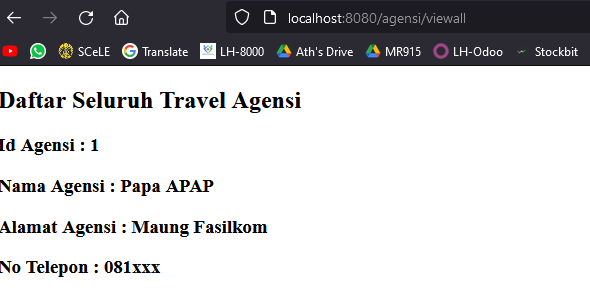

# Tutorial APAP
## Authors
* **MUHAMMAD RIZKY ATHLLAH** - *1906398982* - *B*

## Tutorial 7
### Pertanyaan 1
> Pada latihan 1, setelah kita mengisi form dan submit isi form tersebut untuk mengcreate, agar form tidak terisi dengan item 
yang sebelumnya terisi, kita perlu mengosongkan kembali state yang sebelumnya diset untuk item yang diisi.

## Tutorial 7
### Pertanyaan 1
- Latihan 1: 
Pada lattihan ini, saya manambahkan fungsi **handleDeleteItemFromCart** dengan memodifikasi fungsi yang sebelumnya sudah ada,
yaitu handleAddItemToCart. Cara kerjanya adalah dengan cara meng-filter list yang ada agar state cartItems difilter dan 
bebas dari object yang ingin dihapus. Berikut implementasi kodenya: 
 
 
- Latihan 2: 
Pada latihan ini, saya menambahkan logic pada fungsi **handleDeleteItemFromCart** dan **handleAddItemToCart** dengan 
mengambil nilai balance dari state, kemudian menyesuaikan logic untuk setiap fungsinya, yaitu apabila manambah barang berarti
balance berkurang, dan sebaliknya. Berikut implementasi kodenya: 
 
 
- Latihan 3: 
Pada latihan ini, saya hanya menambahkan kondisi yang sesuai apabila saat menjalankan fungsi **handleAddItemToCart** balance
baru bernilai negatif, maka alert akan muncul, dan item tidak dimasukkan ke dalam cart list. Berikut implementasi kodenya: 
 

### Pertanyaan 2
> Berdasarkan eksplorasi saya dalam tutorial kali ini, perbedaan antara props dan state adalah bahwa state merupakan sesuatu
yang dimiliki komponen secara internal dan dikontrol oleh komponen itu sendiri, sedangkan props bisa diambil dari komponen lain
dan bisa dikontrol oleh komponen lain yang menggunakan (merender) komponen yang memiliki props tersebut.

### Pertanyaan 3
> Komponen sebaiknya digunakan dalam implementasi react agar setiap komponen yang diimplementasikan akan bersifat reusable,
walaupun secara kompleksitas akan lebih rumit.

### Pertanyaan 4
> Functional component berupa simple javascript yang mereturn html UI dalam setiap komponennya.
> Class component berupa component-component yang disimpan, dimana harus dilakukan rendering untuk diimplementasikan pada html utama.

### Pertanyaan 5
> Element merupakan suatu komponen yang belum dirender, namun component bisa dibilang juga sebagai component object yang sudah dirender

## Tutorial 6
### Pertanyaan 1
> **Otentikasi** merupakan mekanisme yang dilakukan sebuah aplikasi untuk mengetahui siapa yang sedang mengakses aplikasi.
Konsep ini diimplementasikan pada class WebSecurityConfig, UserDetailsServiceImpl, dan data terkait user disimpan pada 
model untuk digunakan pada class-class yang disebutkan sebelumnya

> **Otorisasi** merupakan mekanisme yang dilakukan aplikasi untuk menyesuaikan apa saja wewenang yang bisa diperoleh suatu role
Konsep ini diimplementasikan pada class WebSecurityConfig, dan pada bagian html (untuk menyesuaikan role dengan aksesibilitas fitur)

### Pertanyaan 2
> **BCryptPasswordEncoder** merupakan default implementation dari algoritma BCrypt yang digunakan untuk melakukan hashing 
password. Algoritma ini dijalankan dengan cara secara otomatis menghasilkan dan menggunakan random salt untuk menghitung hash,
itulah sebabnya setiap kali kita memanggilnya, kita bisa mendapatkan output yang berbeda.

### Pertanyaan 3
> Best practicenya password menggunakan hashing, bukan enkripsi. Hal tersebut karena apabila password dienkripsi, masih
memungkinkan untuk didekripsi, sedangkan apabila kita menggunakan hashing, hasil hash tidak mungkin dapat didekripsi.

### Pertanyaan 4
> UUID adalah Universally unique identifier, yang dapat membantu kita mendapatkan unique id secara universal, yang mana
kemungkinannya sangat kecil untuk mendapatkan id yang sama pada suatu sistem.

### Pertanyaan 5
> Class UserDetailsServiceImpl.java digunakan untuk melakukan retrieving data dari database yang kita miliki mengenai
data user, yang kemudian digunakan untuk proses otentikasi

## Tutorial 5
### Pertanyaan 1
> Postman merupakan aplikasi yang bisa digunakan untuk melakukan API testing. Postman memfasilitasi HTTP Client untuk 
melakukan test terhadap HTTP request. Postman dapat membantu kita untuk menjalankan method-method yang tidak bisa 
dijalankan dengan menggunkaan URL Browser, serperti method PUT, DELETE, POST, dan lain-lain.

### Pertanyaan 2
> **@JsonIgnoreProperties** digunakan untuk mengabaikan logical properties untuk serialization atau deserialization JSON,
sehingga data mudah untuk dihubungkan

> **@JsonProperty** digunakan untuk melakukan mapping terhadap key dari property name dalam JSON saat melakukan 
serialization atau deserialization

### Pertanyaan 3
> WebClient merpupakan interface yang bisa digunakan untuk melakukan pemanggilan method rest, seperti GET, POST, PUT,
PATCH, DELETE, dan lain-lain

### Pertanyaan 4
> ResponseEntity merepresentasikan HTTP response yang diberikan ketika suatu method telah dijalankan. HTTP response ini 
meliputi header, body, dan status

> BindingResult

## Tutorial 4
### Pertanyaan 1
- **th:include** berarti fragment atau konten akan masuk di dalam objek htmlnya (objek html menjadi pembungkus)
- **th:replce** berarti fragment atau konten akan menggantikan posisi objek html, sehingga objek htmlnya tidak menjadi pembunkus fragment
### Pertanyaan 2
**th:object** digunakan untuk menginisiasi objek yang kemudian data yang dikirim bisa diterima Spring berdasarkan 
tabel data yang bersesuaian
### Pertanyaan 3
- '$' digunakan untuk inisiasi suatu variable yang dikirimkan melalui spring controller.
- '*' digunakan untuk mengambil atribut dari data yang dideclare sebelumnya menggunakan tanda '$'.

## Tutorial 3
### Pertanyaan 1
- **@AllArgsConstructor** membuat constructor pada suatu class dengan parameternya adalah semua field pada class (masing-masing field satu parameter)
- **@NoArgsConstructor** membuat constructor pada class tanpa parameter yang menginisiasi field
- **@Setter** dan **@Getter** digunakan untuk meng-generate setter dan getter field pada class yang dapat menghubungkannya dengan database
- **@Entity** memberikan penanda bahwa class yang akan dibuat dibawahnya merupakan entity yang akan dibuat pada database
- **@Table** menginsiasi database untuk membuat tabel baru dengan nama yang sesuai
### Pertanyaan 2
Method *findByNoAgensi* digunakan untuk mendapatkan suatu agensi yang tersimpan pada database berdasarkan field noAgensi.
Apabila tidak ditemukan, method tersebut dapat mengembalikan null.
### Pertanyaan 3
**@JoinColumn** menyimpan id dari table yang dijoin dalam sebuah kolom baru 
**@JoinTable** menyimpan id dari kedua table dan membuat table baru yang berisi relationship kedua table dan isinya
### Pertanyaan 4
**name** digunakan untuk menyatakan relasi many-to-one dengan entity travel_agensi dengan menggunakan 
atribut identifier TravelAgensi yang sudah terbuat pada database (dalam hal ini 'no_agensi'). 
**referencedColumnName** diambil berdasarkan atribut identifier pada class TravelAgensiModel (bukan 
pada database), yaitu atribut noAgensi untuk mengatur logika many-to-one dengan class TravelAgensiModel 
**nullable** merupakan anotasi untuk mendeclare bahwa kolom tersebut tidak dapat bernilai null. Sedangkan,
anotasi **@NotNull** digunakan oleh java untuk melakukan validasi, apakah field yang akan diisi bernilai
null atau tidak
### Pertanyaan 5
- **FetchType.Lazy** melakukan fetch hanya apabila fetch dibutuhkan
- **FetchType.EAGER** fetch dilakukan secara langsung
- **CascadeType.ALL** akan melakukan semua tindakan (PERSIST, REMOVE, REFRESH, MERGE, DETACH)

---
## Tutorial 2
### What I have learned today
### Pertanyaan 1
Setelah dirun, masih terjadi error karena template belum dibuat. Sedangkan pada implementasi kode
pada Controller, method untuk mapping ke link tersebut sudah mereturn nama html. Namun html belum 
dibuat.
### Pertanyaan 2
<b>@Autowired</b> merupakan implementasi dari konsep Dependecy Injections. Dengan menggunakan autowired,
data yang didapatkan dari apa yang diimplementasikan pada bagian controller akan langsung tersambung 
dengan instance yang berada pada bagian service. Pada kasus ini, ketika kita melakukan perubahan instance
travelAgensiService pada bagian controller, maka data tersebut akan dibagikan ke bagian service sehingga
data yang sudah disimpan pada request-request sebelumnya tetap tersimpan.
### Pertanyaan 3
Setelah mengakses link tersebut untuk melakukan add Agensi, terjadi error karena
parameter yang diberikan pada link tersebut tidak terdapat noTelepon yang 
seharusnya pada implementasi kode harus tertera pada request parameter.
### Pertanyaan 4
Untuk melihat detail sebuah travel agensi, kita dapat menggunakan mapping yang 
sesuai,yaitu "/agensi/view?idAgensi=xx", sehingga link yang bisa digunakan:
http://localhost:8080/agensi/view?idAgensi=1 karena Papa APAP memiliki idAgensi 1
### Pertanyaan 5
link: http://localhost:8080/agensi/add?idAgensi=2&namaAgensi=Mama%20AMAM&alamat=Universitas%20Indonesia&noTelepon=123xxx  
Setelah Add:

Tampak View All

### Latihan
1. Fitur: Mencari daftar agensi berdasarkan nama Agensi.
Diakses pada link http://localhost:8080/agensi/view/nama-agensi/Papa%20APAP

2. Fitur: Meng-update idAgensi Agensi. Implementasi fungsi update dibuat pada bagian Service. Diakses pada link
http://localhost:8080/agensi/update/1/id-agensi/2
Bukti id berubah: 
a. Menambahkan data dengan id 1

 
b. Meng-update id dari data dengan id 1
 
c. Id 1 telah berubah jadi 2
 
3. Remove data by id
a. Menambahkan data dengan id 1

 
b. Melakukan remove, dan hasil remove bisa dilihat dengan hilangnya data pada viewAll
 

---
## Tutorial 1
### What I have learned today
Pada Tutorial 1 kali ini, saya telah cukup memahami cara menggunakan Git secara lebih mendalam.
Selain itu, saya juga telah mempelajari bagaimana cara membuat sebuah project Spring Boot, yang
diawali dengan download di Spring Initializer sampai ke konsep dari Spring Boot itu sendiri.
### Github
1. Apa itu Issue Tracker? Apa saja masalah yang dapat diselesaikan dengan Issue Tracker?
Issue Tracker merupakan isu yang bisa saja ditemukan oleh programmer dalam melakukan 
pemrogramannya. Dengan issue tracker, segala macam masalah yang dialami programmer bisa dituliskan
sehingga lebih terdokumentasi baik masalah yang dihadapi, maupun solusi terhadap permasalahan tersebut.
2. Apa perbedaan dari git merge dan git merge --squash?
Dalam melakukan merge, terdapat lebih dari satu parent branch. Ketika kita melakukan Git merge,
maka hasil commit dari merge tersebut memiliki dua buat parent. sedangkan, git merge --squash
hanya akan mencatat parent targetnya saja, sehingga merge tersebut hanya memiliki 1 parent.
3. Apa keunggulan menggunakan Version Control System seperti Git dalam pengembangan
suatu aplikasi?
Dengan menggunakan Git, proses pemrograman dari awal hingga akhir terdokumentasi dengan jelas,
baik dari bagian penyelesaian solusi programming, bug, dan lain-lain. Github juga memudahkan 
programmer untuk melakukan kerja sama tim dalam programming, sehingga suatu projek bisa 
lebih mudah dikerjakan bersama-sama menggunakan github.
### Spring
4. Apa itu library & dependency?
Library merupakan file java yang sudah terdokumentasi yang bisa digunakan untuk membantu 
programmer dalam menyelesaikan masalah. Dependency adalah hubungan yang dibutuhkan sebuah kode
dengan kode yang lain agar suatu program bisa dijalankan sesuai ekspektasi.
5. Apa itu Maven? Mengapa kita menggunakan Maven? Apakah ada alternatif dari Maven?
Maven adalah tool untuk me-manage project yang akan kita buat yang memudahkan kita dalam membuat
project aplikasi. Dengan menggunakan maven, kita dipermudah dalam menambahkan berbagai dependencies
daru project yang akan dibuat. Terdapat alternatif dari Maven yang bisa digunakan, yaitu Postman, TeamCity, 
CircleCI, Red Hat Ansible Automation Platform, dan lain-lain.
6. Selain untuk pengembangan web, apa saja yang bisa dikembangkan dengan Spring
framework?
Spring framework bisa digunakan untuk membuat aplikasi berbasis java. 
7. Apa perbedaan dari @RequestParam dan @PathVariable? Kapan sebaiknya
menggunakan @RequestParam atau @PathVariable?
@RequestParam digunakan untuk mendapatkan parameter Query dari URI.
@PathVariable digunakan untuk value parameter yang dinamis.
### What I did not understand
Saya masih belum mengerti bagaimana cara kerja Maven sehingga bisa menghubungkan antara satu 
dependency dengan dependencies yang lain.
(tuliskan apa saja yang kurang Anda mengerti, Anda dapat men-_check_ apabila Anda
sudah mengerti dikemudian hari, dan tambahkan tulisan yang membuat Anda mengerti)
- [ ] Kenapa saya harus belajar APAP?
- [x] Kenapa?
Karena 
